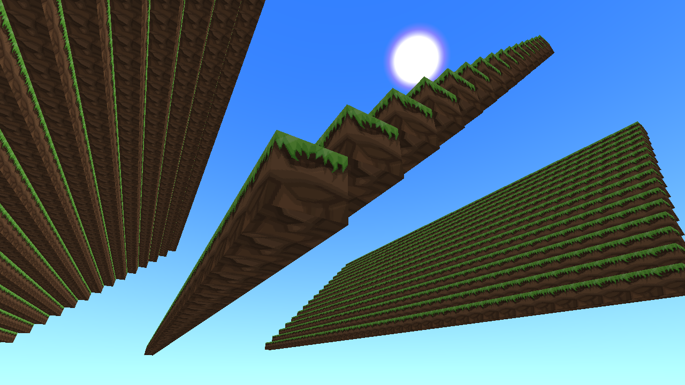
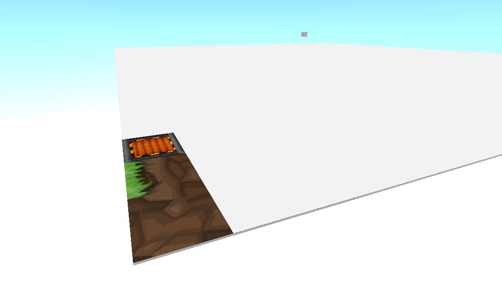

# AtominaCraftV4

I've made this same "game" about 10 times now because i keep getting bored/stuck... but if anything, this will be the one i actually complete :)

## Rendering
Block rendering is done in the Tesselator class. It uses a cube mesh, using a single VBO of vertex data (36 in total), and uses glEnableVertexAttribArray and glVertexAttribPointer to specify the specific vertex/normal/UV data

A texture shader is used, which also contains a uniform vec2 offset for the texture coordinate 

To render specific faces, some UV calculations are used to set the shader's UV offset. That offset gets you the texture in the texture atlas. And then finally, you render the cube (glDrawArrays)

But, that assumes you want the same texture for all faces. What i do, is calculate the UV offset for each face based on what the a block is setup to do, and then i draw only parts of the cube in glDrawArrays (because you can specify an offset and count)

## Game preview :)

## Getting the texture atlast to work...

